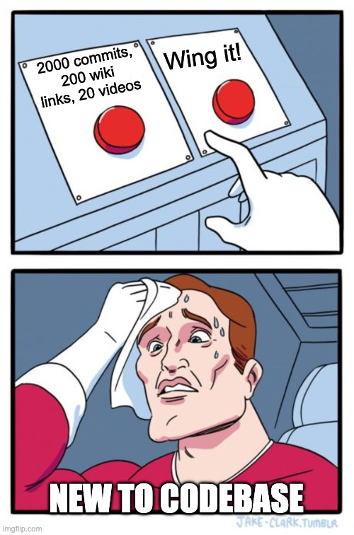
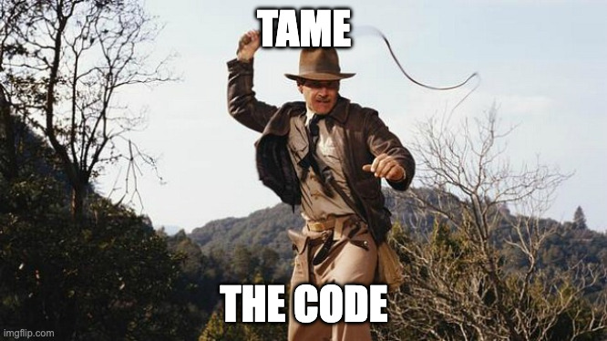

# Code Archaeology

> *Read the codebase like a book. Chapter by chapter. With a guide who answers back.*

A skill for AI coding agents (Claude Code, OpenCode, Cursor, …) that turns a repo's git history + GitHub issues/PRs/discussions into a chapter-based, interactive learning experience. You run `/dig`, the agent does the digging, and you come out the other side understanding the codebase like someone who's been on the team a year.

## You just joined the team

You open the repo. **2,000 commits.** 200+ tickets. 14 contributors. Half of them don't work here anymore. The README was last updated in 2023.

What do you do?



You read the code. You find a decision that makes no sense. You want to ask your teammates but you've been here 3 days and they seem busy and you don't want to be *that* person.

What do you do?


You be Indiana Jones \*cracks whip. You **dig**. You study the history, chapter by chapter, until you understand *why* things are the way they are — and you can challenge them with evidence.



## What it does

1. **Survey** — commits, contributors, ticket patterns, infra files, gaps in documentation, the suspicious silence around `legacy_v2/`.
2. **Identify chapters** — natural breakpoints in the project's life. Team transitions. Migrations. The Great Refactor of 2022. The incident that shall not be named.
3. **Deep-dive** — for each chapter, walk you through what happened, who did it, why, and what got abandoned along the way.
4. **Quiz you back** — *why not the simpler thing?* *what breaks if this assumption is wrong?* *was this eventually replaced?* You answer. You learn. The chapter writes itself into `PROJECT_HISTORY.md` and `chapters/<n>-<name>.md`.

The Q&A is the load-bearing phase. Steps 1–3 produce a draft; step 4 — the conversation — is where you actually learn the system.

## Install

### Claude Code (one-liner via marketplace)

```
/plugin marketplace add twitu/indiana-codes
/plugin install dig@indiana-codes
```

That's it. Restart and `/dig` will appear in your slash-command menu in any repo with git history.

### Manual install (OpenCode, Cursor, anything else)

Clone the repo first. The skill content is identical across agents — only the install path differs.

```bash
git clone https://github.com/twitu/indiana-codes ~/.local/share/indiana-codes
cd ~/.local/share/indiana-codes
```

#### OpenCode

```bash
mkdir -p ~/.config/opencode/skills ~/.config/opencode/commands
ln -sf ~/.local/share/indiana-codes/dig         ~/.config/opencode/skills/dig
ln -sf ~/.local/share/indiana-codes/commands/dig.md  ~/.config/opencode/commands/dig.md
```

#### Cursor

Cursor has no skills directory, so the command file points the agent at the cloned `SKILL.md` directly:

```bash
mkdir -p ~/.cursor/commands
cat > ~/.cursor/commands/dig.md <<EOF
---
description: Code archaeology — chapter-based history walkthrough
---
Follow the skill instructions in $HOME/.local/share/indiana-codes/dig/SKILL.md to perform a codebase excavation pass on this repository.
EOF
```

Project-scoped install (commits with the repo) is the same, but writes to `.cursor/commands/` instead of `~/.cursor/commands/`.

#### Other agents (Codex, Aider, Continue, Zed, …)

Drop the contents of `dig/SKILL.md` into your agent's long-lived instruction file (`AGENTS.md`, `~/.aider.conf.yml`, system prompt, etc.). See [OTHER_AGENTS.md](./OTHER_AGENTS.md) for per-agent recipes.

Restart your agent. You should see `/dig` when you type `/`.

## Use it

In your agent of choice, in any repo with git history:

```
/dig
```

The agent surveys the repo, proposes chapters, and asks which one to start with. Then:

```
Tell me about chapter 1.
```

```
Why didn't they just use Postgres here?
```

```
Was the v2 API ever finished, or is it abandonware?
```

```
Skip ahead to the chapter about the auth migration.
```

It answers. You push back. By the end of each chapter, you know the chapter — and a markdown file knows it too.

In a fresh chat, no need to re-run `/dig` — just point the agent at the existing `PROJECT_HISTORY.md`:

```
Based on PROJECT_HISTORY.md, walk me through chapter 3.
```

## See it in action

Sample books — the output of running this on well-known repos — live on the [project site](https://twitu.github.io/indiana-codes/). Good place to start if you want a feel for what a finished excavation looks like before you point it at your own repo.

## Connect more sources (optional)

The skill uses whatever it can find. More sources = better chapters.

| Source | How |
|---|---|
| Git history | Built in. Always on. |
| GitHub issues / PRs / discussions | Local [`gh`](https://cli.github.com/) CLI works out of the box. The official [GitHub MCP](https://github.com/github/github-mcp-server) is even better. |
| GitHub releases | Same: `gh release` or the MCP. |
| Jira / Linear / Confluence / Notion | If your team has the corresponding MCP configured in your agent, the skill picks it up automatically — no extra setup. |
| Local docs | `docs/`, `adr/`, `rfc/`, `CHANGELOG.md` — read automatically. |

## License

MIT. Go dig.
